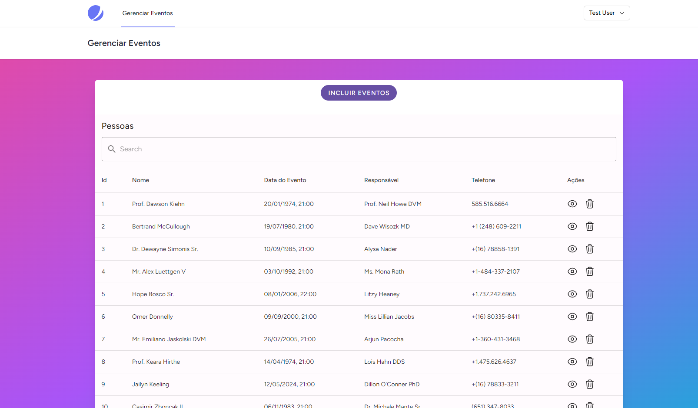

# Neste Projeto
Neste projeto eu desenvolvi um sistema de gerenciamento de eventos, um grud com autenticação!

## Preview
- Pagina para Gerenciar os eventos


- Modal para Criar os eventos


- Pagina para Visualização e edição


### Informações Tecnicas
- Backend: foram utilizados php, Laravel e Inertia para desenvolvimento Backend
e para o banco de dados usei MySQL.

- Front-end: Desenvolvi uma interface simples usando Vue.js, Tailwind CSS
e também o Vuetify para os componentes. E para o svg e icones escolhi os sites https://heroicons.com/ e https://undraw.co/illustrations

### How to use:
- A versão do PHP utilizada no Projeto é PHP 8.2.11
- clique no botão verde acima (<> código) e copie o link: https://github.com/KatyHummes/    .git
- configure o banco de dados com .env
- Copie o arquivo **.env.example** para **.env** e configure as variáveis de ambiente relacionadas ao banco de dados
- execute os comandos:
```
composer install
```
```
npm install
```
- então execute o comando
```
php artisan key:generate
```
- abra o servidor:
```
php artisan serve
```
- deixe o npm em execução:
```
npm run dev
```
- execute as migrações: (seeder são opcionais)
```
php artisan migrate --seed
```
- e finalmente execute este comando:
```
php artisan storage:link
```
- acessar a URL: http://127.0.0.1:8000/

## Links das Bibliotecas e outros usados no Projeto:
https://jetstream.laravel.com/ para a autenticação e configurações iniciais,
https://vuetifyjs.com/en/ e https://tailwindcss.com/ para alguns componentes e estruturas do front-end, https://undraw.co/illustrations para os svgs, https://www.npmjs.com/package/vue-toast-notification para as notificações de sucesso ou erro do frontend, https://www.npmjs.com/package/vue-the-mask para a mascara do telefone